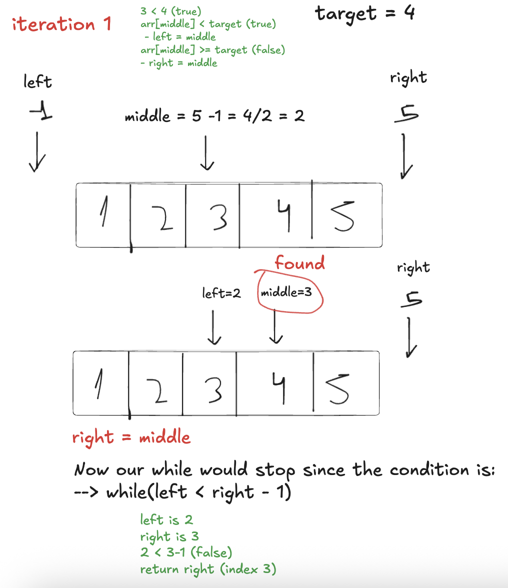

# Binary Search

- Is an algorithm that, given `1. a data structure with numbers sorted in ascending order` and `2. a target value, will find the target value if present` in `O(log n) time complexity` and `O(1) space complexity`.
- It is based on a very primitive idea:
  - Before the internet, if you wanted to find the meaning of a word, you needed to use a **dictionary**. We know that the dictionary is alphabetically sorted in ascending order: `a, b, c...`.
  - If we wanted a word starting with N, like "Nature," we wouldn’t check every single page. Instead, we would `open the book near the middle`, and if the page we opened wasn’t close to N, we would `move forward or backward by about half the remaining distance`, repeating this process **until we found the word**.

## Visualizing Binary Search

- We start `left = -1, right = n`
- Then we get `middle = (right - left) / 2`; (truncating the floating value)
  - `if arr[middle] < target` we need to check the right side of this middle value and we do this using: `left=middle`
  - `if arr[middle] >= target` we need to check the left side of middle value `right=middle`
- First array has `size n`, second array has `size n/2`, third array has `size n/4` and so on..
- While input grows geometrically times 2: `10, 20, 40, ...`
- Iterations grows linearly +1: `log2(10)=3.3`, `log2(20)=4.3`, `log2(40)=5.3`



## Important: What are `Invariants`?

- An invariant in algorithm is a statement that is always true (**doesn't change**) while the algorithm runs.
- Think of it like a rule or condition that always holds, no matter how many times the loop runs.

### Example:

- `Invariant`: After each loop max_number always holds the biggest number seen so far.

```c
#include <stdio.h>

int main() {
  int numbers[] = {3, 7, 2, 9, 5};
  int arraySize = sizeof(numbers) / sizeof(int);
  int max_number = numbers[0]; // start assuming the first number is the biggest

  for (int i = 1; i < arraySize; i++) {
    if (numbers[i] > max_number) {
      max_number = numbers[i]; // update max_number if we find a bigger number
    }
  }

  printf("The maximum number is: %d\n", max_number);

  return 0;
}
```

## How to implement Binary Search:

```c
#include <stdio.h>

// Assumes array is sorted in ascending order.
int binarySearch(int target, int arraySize, int array[]) {
  if(arraySize == 0) {
    return -1;
  }

  int left = -1, right = arraySize;
  while(left < right - 1) {
    int middle = left + ((right - left) / 2);  // this is important in c to avoid overflow
    // Invariants: v[l] < x <= v[r]
    if(array[middle] < target) { // if middle < target: left = middle
      left = middle;
    } else { // if middle >= target: right = middle
      right = middle;
    }
  }

  return right >= 0 && right < arraySize && array[right] == target ? right : -1;
}

int main() {
  int numbers[] = {1, 2, 3, 99, 100, 101};  // size 6
  int numbers2[] = {};  // size 0

  int res99 = binarySearch(99, sizeof(numbers) / sizeof(int), numbers);
  int res333 = binarySearch(333, sizeof(numbers) / sizeof(int), numbers);
  int res0 = binarySearch(1, sizeof(numbers2) / sizeof(int), numbers2);

  printf("index: %d\n", res99);  // index: 3
  printf("index: %d\n", res333);  // index: -1
  printf("index: %d\n", res0);  // index: -1

  return 0;
}
```

### How do we guarantee the invariants of Binary Search?

- Since `left` starts at `-1`, there are no indices i <= left, so the condition `v[i] < x holds` vacuously.
- Similarly, since `right` starts at `n`, no indices i >= right exist, so `v[i] >= x also holds` vacuously.

- **The invariant is preserved by**:
  - Only updating `left` when `v[middle] < x`
  - And `right` when `v[middle] >= x`

## References:

- https://www.ime.usp.br/~pf/algorithms/chapters/binary-search.html
- https://www.geeksforgeeks.org/binary-search/
