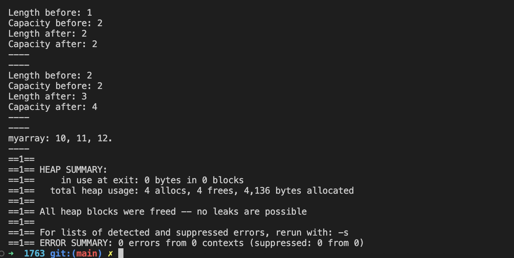

# Dynamic Arrays in C

- In this article we will show how to develop a Dynamic Array in C and also talk about the advantages and disadvantages of each strategy of memory initialization for arrays.

## Prerequisites:

- Basic knowledge of programming (logic, etc);
- C syntax, allocating variables;
- Memory management in C: pointers, malloc, calloc, realloc, free;

## What is a Dynamic Array?

- An array that can grow or shrink in size during runtime.
- Unlike static arrays, which have a fixed size, dynamic arrays automatically resize as elements are added or removed.

## Sizing an Array appropriately

- **Is it a good idea to start an array with a small size and then realloc it? It depends**.
  - If the current memory block can't be extended contiguously, `realloc` will **allocate a new block and copy all n items**. Which results in **O(n) operation** and **can cause an overhead**.
  - When **prioritizing performance** we will prefer to initialize the array with a **large size**.
  - When **prioritizing memory saving** we will prefer to initialize the array with a **small size**.

### Initializing with a Small Size:

- Ideal when the expected **number of items is unknown or varies significantly**.
- This approach offers memory efficiency by only allocating the necessary memory for the array, avoiding waste. However, it can incur performance overhead due to frequent reallocations and potential fragmentation.

### Initializing with a Large Size:

- This is especially useful when the **array size is predictable**.
- Using a larger initial size for a dynamic array can be more efficient because it **reduces the need for frequent reallocations** and avoids the overhead of copying data multiple times.
- However, the trade-off is that it might waste memory if the array doesn't grow as much as expected. Overall, this strategy is beneficial when performance is a priority, and the array's growth pattern is relatively known.

## How to Develop a Dynamic Array in C

- In this code, we define an int pointer using `malloc`. While `calloc` could be used to initialize the array with zeros for memory safety, it's not necessary for this example. We'll discuss memory safety in another article.
- To benefit from dynamic memory allocation, we will start the array with a small capacity of 2 integers, and will grow when needed using `realloc`, we will double the capacity every time we reach the limit.

```c
#include <stdio.h>
#include <stdlib.h>

void dynamicArrayExample(int startCapacity);
void pushToDynamicArray(int** array, int value, int* currentLength, int* currentCapacity);
void printArrayItems(int* array, int arrayLength, char arrayName[]);

int main() {
  int initCapacity = 2;
  dynamicArrayExample(initCapacity);
  return 0;
}

// EXAMPLE: Doubling the capacity every time we reach the limit
void dynamicArrayExample(int startCapacity) {
  int* numbers = (int*)malloc(sizeof(int) * startCapacity);
  if(numbers == NULL) {
    printf("malloc failed.\n");
    exit(1);
  }
  int currentArrayCapacity = startCapacity;
  int currentArrayLength = startCapacity;

  numbers[0] = 10;
  numbers[1] = 11;

  printArrayItems(numbers, currentArrayLength, "numbers");  // numbers: 10, 11.

  // numbers[0] = 10; -> this could lead to an unexpected behavior writing on memory that is not "held" by the pointer

  // adding the 3rd item | capacity goes from 2 to 4
  pushToDynamicArray(&numbers, 12, &currentArrayLength, &currentArrayCapacity);

  printArrayItems(numbers, currentArrayLength, "numbers");  // numbers: 10, 11, 12.

  // adding the 4th item | capacity remains 4
  pushToDynamicArray(&numbers, 13, &currentArrayLength, &currentArrayCapacity);
  // adding the 5th item | capacity goes from 4 to 8
  pushToDynamicArray(&numbers, 14, &currentArrayLength, &currentArrayCapacity);

  printArrayItems(numbers, currentArrayLength, "numbers");  // numbers: 10, 11, 12, 13, 14.
}

void pushToDynamicArray(int** array, int value, int* currentLength, int* currentCapacity) {
  printf("BEFORE currentLength: %d \n", *currentLength);
  printf("BEFORE currentCapacity: %d \n", *currentCapacity);

  int newCapacity = *currentCapacity;
  *currentLength = *currentLength + 1;  // adding 1 item to the length

  if(*currentLength > *currentCapacity) {
    *currentCapacity *= 2;  // doubling capacity strategy
    int* tempArray = (int*)realloc(*array, sizeof(int) * (*currentCapacity));  // resizing with realloc
    if(tempArray == NULL) {
      printf("realloc failed.\n");
      exit(1);
    }
    *array = tempArray;
  }

  (*array)[(*currentLength) - 1] = value;

  printf("AFTER currentLength: %d \n", *currentLength);
  printf("AFTER currentCapacity: %d \n", *currentCapacity);
}

void printArrayItems(int* array, int arrayLength, char arrayName[]) {
  printf("----\n");

  printf("%s: ", arrayName);
  for(int i = 0; i < arrayLength; i++) {
    printf("%d", array[i]);
    if(i + 1 == arrayLength) {
      printf(".\n");
    } else {
      printf(", ");
    }
  }

  printf("----\n");
}
```

## Improvements - "Struct Implementation":

- After understanding the concept, let's implement a struct called `DynamicArray`.
- We could create a `struct` to encapsulate both `arrayCapacity` and `arrayLength` for better organization and to simplify the management of the dynamic array.

```c
#include <stdio.h>
#include <stdlib.h>

struct {
  int* values;
  int capacity;
  int length;
} typedef DynamicArray;

DynamicArray* initializeDynamicArray(int initialCapacity);
void pushToDynamicArray(DynamicArray* array, int value);
void printDynamicArray(DynamicArray* array, char arrayName[]);

int main() {
  int initialCapacity = 2;
  DynamicArray* array = initializeDynamicArray(initialCapacity);

  pushToDynamicArray(array, 10); // length: 1, capacity: 2
  pushToDynamicArray(array, 11); // length: 2, capacity: 2
  pushToDynamicArray(array, 12); // length: 3, capacity: 4

  printDynamicArray(array, "myarray"); // 10, 11, 12.

  return 0;
}

DynamicArray* initializeDynamicArray(int initialCapacity) {
  DynamicArray* array = (DynamicArray*)malloc(sizeof(DynamicArray));
  if(array == NULL) {
    printf("malloc failed.\n");
    exit(1);
  }
  array->values = (int*)(malloc(sizeof(int) * initialCapacity));
  if(array->values == NULL) {
    printf("malloc failed2.\n");
    exit(1);
  }
  array->capacity = initialCapacity;
  array->length = 0;
  return array;
}

void pushToDynamicArray(DynamicArray* array, int value) {
  printf("----\n");
  printf("Length before: %d\n", array->length);
  printf("Capacity before: %d\n", array->capacity);

  array->length += 1;
  if(array->length > array->capacity) {
    array->capacity *= 2;
    array->values = (int*)realloc(array->values, sizeof(int) * array->capacity);  // doubling size
    if(array->values == NULL) {
      printf("realloc failed.\n");
      exit(1);
    }
  }
  array->values[array->length - 1] = value;

  printf("Length after: %d\n", array->length);
  printf("Capacity after: %d\n", array->capacity);
  printf("----\n");
}

void printDynamicArray(DynamicArray* array, char arrayName[]) {
  printf("----\n");

  printf("%s: ", arrayName);
  for(int i = 0; i < array->length; i++) {
    printf("%d", array->values[i]);
    if(i + 1 == array->length) {
      printf(".\n");
    } else {
      printf(", ");
    }
  }

  printf("----\n");
}
```

## Valgrind:



## Thoughts

- You can use dynamic allocation by doubling the capacity when it reaches the limit. This helps save resources and improve performance.

## References

- https://www.geeksforgeeks.org/dynamic-array-in-c/
- https://stackoverflow.com/questions/3536153/c-dynamically-growing-array
