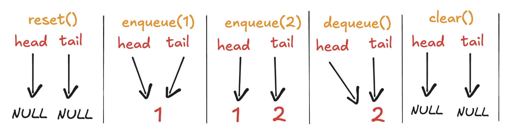
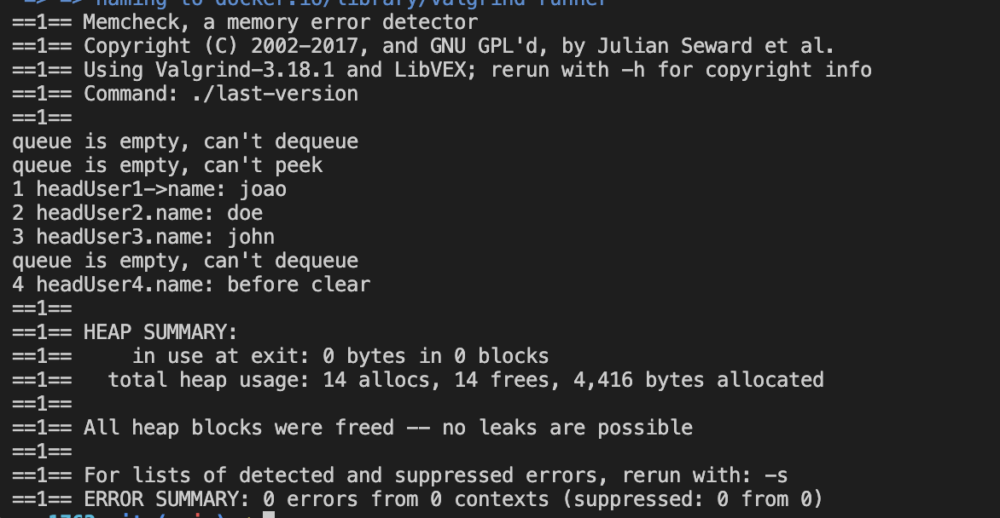

# Queue

- A queue is a `data structure`, and as such, it follows specific rules.
- Queue works following: `FIFO - First in First Out`
  - Which means that when you queue two items `1st: A`, `2nd: B`; if you make a `dequeue` it will return the first inserted item `A`.

## Properties of a Queue

- `head`: The current "first item of the line", this will be returned if dequeue is called.
- `tail`: The last added item.
- `size`: Current size of the queue.
- `limit`: Max size of the queue.

## Methods of a Queue

- `reset`: Reset the queue settings `head=0`, `tail=0`;
- `enqueue`: Insert a new item in the queue.
- `dequeue`: Removes the first added item of the queue (that is on the queue for more time) and **remove it**.
- `peek`: return the first added item of the queue **without removing it**.
- `clear`: removes all elements of the queue.
- `isEmpty`: Check if queue is empty `head == tail`.
  - We **use** it to check **before dequeue** any element, to **avoid queue underflow**.

## Visualizing Queue

## How to implement Queue:

- 1. Understand the theory and rules behind a queue
- 2. Understand the properties and methods it generally implements
- 3. Code it
  - As you can see we have **implemented** it **using a linked list**.
  - We could also use an array but as we need to remove the first item of the queue (FIFO) we would need to do some workarounds to solve it.
  - [Queue C](./queue.c)

## Valgrind:

## Reference

- Cormen, T. H., Leiserson, C. E., Rivest, R. L., & Stein, C. (2009). _Introduction to Algorithms_ (3rd ed.). MIT Press.
