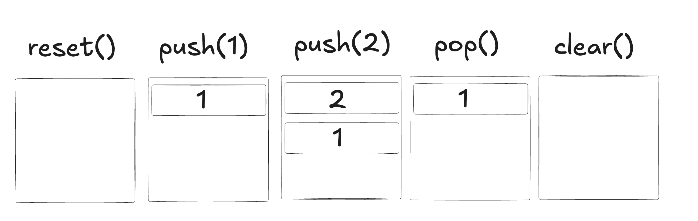

# Stack

- A stack is a `data structure`, and as a such, it follows specific rules.
- Stack works following: `LIFO - Last in First Out`
  - Which means that when you push two items `1st: A`, `2nd: B`; if you make a `pop` it will first return the last inserted `B`.

## Properties of a Stack

- `base`: Starting point or initial index.
- `top`: Current amount of items or index of the top item (depending of the implementation).
- `limit`: The max size of the stack.
- `items`: Stored items.

## Methods of a Stack

- `reset`: Reset the stack setting `base=0`, `top=0`, `limit` and `items`;
- `push`: Insert a new item to the top of the stack.
- `pop`: Return the last inserted item and **removes it** from the stack.
- `peek`: Return the last inserted item **without removing** it from the stack.
- `clear`: Clear and free all memory for the stack.
- `isFull`: Used on push to check if stack is full.
  - If we try to push on a full stack we got a `stack overflow`
- `isEmpty`: Used on pop and peek to check if stack is empty.
  - If we try to pop on a empty stack we got a `stack underflow`

## Visualizing Stack

## How to implement Stack:

- 1. Understand the theory and rules behind a stack
- 2. Understand the properties and methods it generally implements
- 3. Code it
  - A stack can be implemented using either an array or a linked list; each has its own advantages and disadvantages.
  - In this implementation, I used an array.
  - [Stack C](./stack.c)

## Valgrind:

## Reference

- Cormen, T. H., Leiserson, C. E., Rivest, R. L., & Stein, C. (2009). _Introduction to Algorithms_ (3rd ed.). MIT Press.
