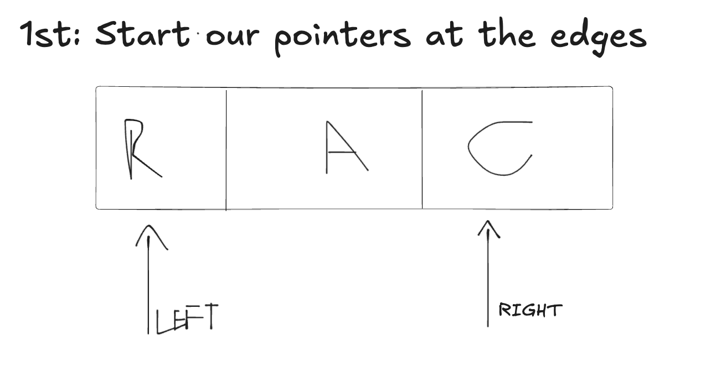
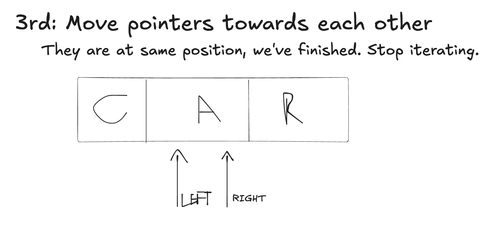
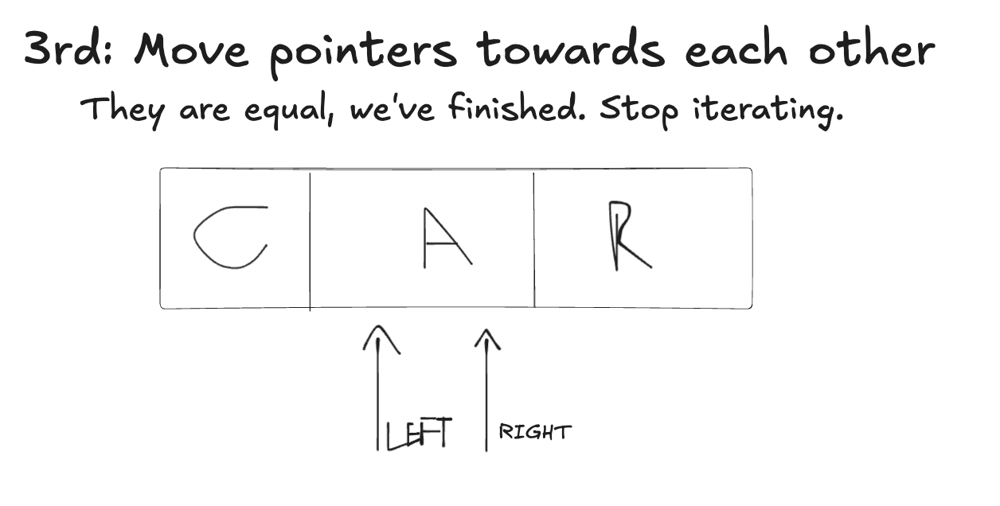

# Two Pointers

- It is a technique used to solve problems involving arrays, lists or strings. (remember, strings are also arrays).
- We basically use two variables (pointers) to move through the data structure based on certain conditions.
  - We will discuss an example below;
  - But it's important to know that we can move these pointers following any rules, normally we start at the edges, but it depends of the problem. Attention to the problem is the most important thing!

## Advantages:

- Instead of using brute force normally `O(n^2)` time complexity or storing extra data and growing space complexity, The two pointers technique helps reduce time complexity to `O(n)` or less, without increasing space complexity too.

## Implementing Two Pointers to Reverse a String

- We init our pointers at the edges of the string.
- Then we start iterating the string, moving they towards each other.
- Each iteration we swap the characters at these positions.
- We don't want to iterate if left >= right.

```c
// https://leetcode.com/problems/reverse-string/

// Time complexity O(n)
// Auxiliary Space O(1) (we didn't stored the entire array duplicated)
// Space complexity O(n) (the input string itself)
void reverseString(char* s, int sSize) {
  int left = 0;
  int right = sSize - 1;

  while(left < right) {  // they can't be equal, and left can't be higher than right
    char temp = s[left];
    s[left] = s[right];
    s[right] = temp;

    left += 1;
    right -= 1;
  }
}
```

## Visualizing:







## What else could we solve with this?

- **Valid palindrome**: https://leetcode.com/problems/valid-palindrome/description/
- **Two sum in sorted array**: https://leetcode.com/problems/two-sum-ii-input-array-is-sorted/description/
- **3 Sum**: https://www.geeksforgeeks.org/find-a-triplet-that-sum-to-a-given-value/
- **4 Sum**: https://www.geeksforgeeks.org/find-four-numbers-with-sum-equal-to-given-sum/
- and many more!

## References

- https://www.geeksforgeeks.org/two-pointers-technique/
- https://medium.com/@johnnyJK/data-structures-and-algorithms-907a63d691c1
