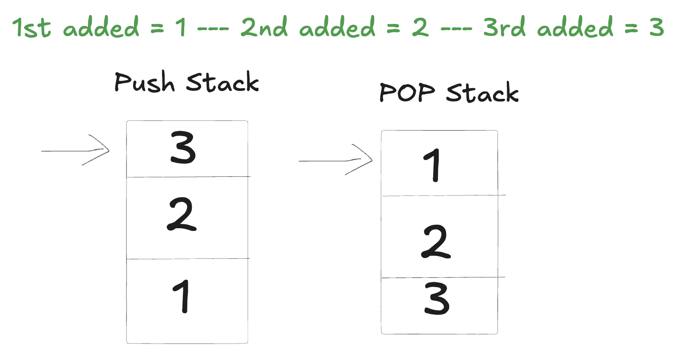

# 232. Implement Queue using Stacks

- Problem: https://leetcode.com/problems/implement-queue-using-stacks/
- We made it by creating two stacks: one for pop, one for push.

## Solution example:

- Separate into two stacks: `pushStack` and `popStack`.
- We start by filling our "queue" with the `pushStack`:

  ```
  pushStack: []
  push(1); push(2); push(3);
  pushStack: [3, 2, 1]
  ```

- (3 is the top, but 1 was the first added, the exact opposite of a queue)

- Now if we want to do a `queue.pop()` it should return the first added item, which is 1.
- So we use another stack, the `popStack`. We move items from `pushStack` to `popStack` using `pushStack.pop()` and `popStack.push(value)`:

  ```
  popStack: [1, 2, 3]
  ```

- Now if we call `popStack.pop()` we get the first added element, which is 1.

- **Note**: We only move everything from pushStack to popStack if popStack is empty. We don't need to do it all the time.
  - We can continue pushing on pushStack and popping on popStack, until popStack is empty, then we move everything.

## Image example


